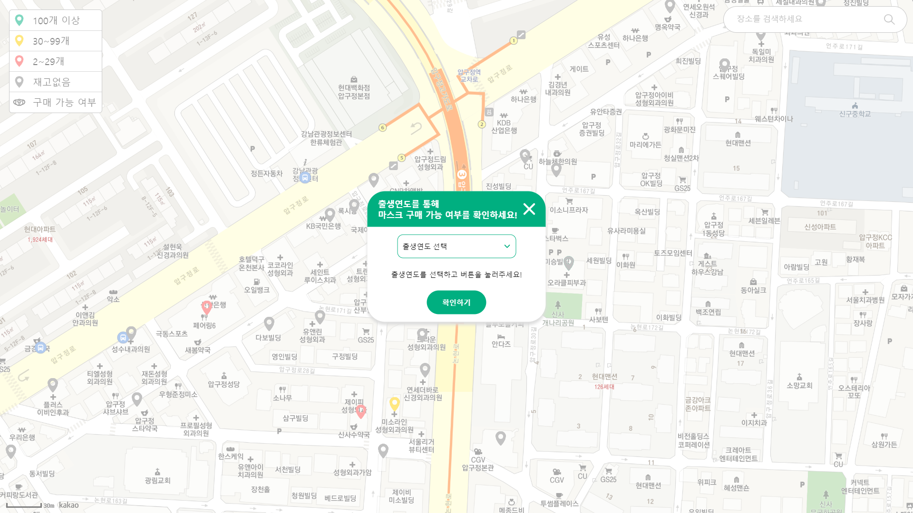
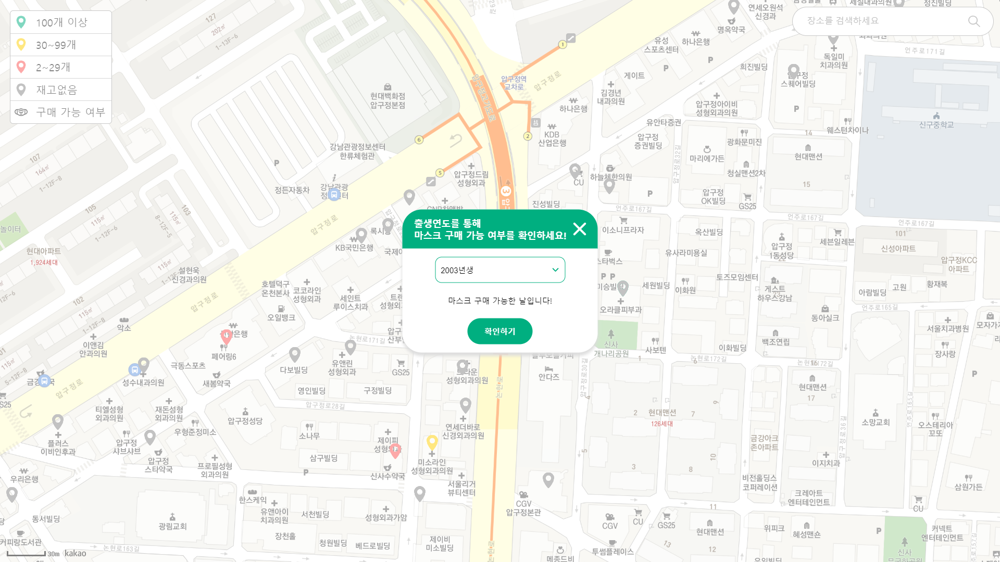
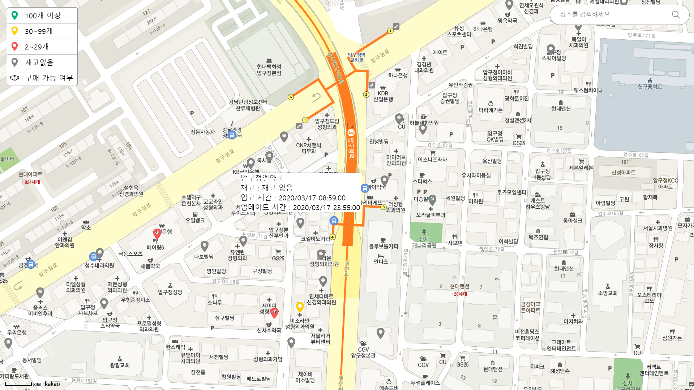
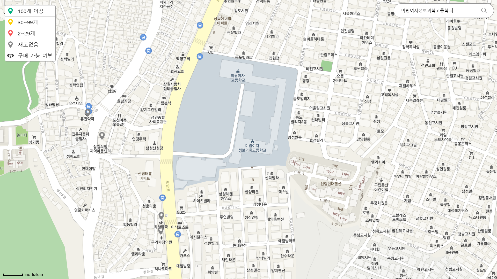

# Public-Mask-Info : 공적 마스크 정보
> 2020.03.   
> 공적 마스크 판매 정보 API를 활용해 공적 마스크 현황 지도를 구현하였습니다.

## Feature
- 공적 마스크 현황 지도
  - `현재 위치`를 기준으로 지도가 표시됩니다.
- 공적 마스크를 판매하는 곳의 위치를 알 수 있습니다.
  - 약국
  - 우체국
  - 농협
  - etc.
- 마커의 색을 통해 `마스크 재고`를 확인할 수 있습니다.
  - 녹색(100개 이상)
  - 노란색(30~99개)
  - 빨간색(2~29개)
  - 회색(0~1개)
- `입고 시간`과 `업데이트 시간`을 확인할 수 있습니다.
- `검색창`에 원하는 위치를 입력하여 정보를 확인할 수 있습니다.
  - 키워드를 통한 장소 검색
- `출생연도`를 이용하여 `마스크 구매 가능 여부`를 확인할 수 있습니다.
  - 마스크 5부제 기준
  - 월요일 1 · 6 / 화요일 2 · 7 / 수요일 3 · 8 / 목요일 4 · 9 / 금요일 5 · 0 / 토·일 주중에 구매 못한 사람

## Screenshot
> 
> 초기 화면 이미지

> **마스크 구매 가능 여부 확인 이미지**
> 
> (마스크 구매 가능시)
>
> (마스크 구매 불가능시)

> 
> 판매처 정보 확인 이미지

>
> 장소 검색 후 화면(미림여자정보과학고등학교 검색)
